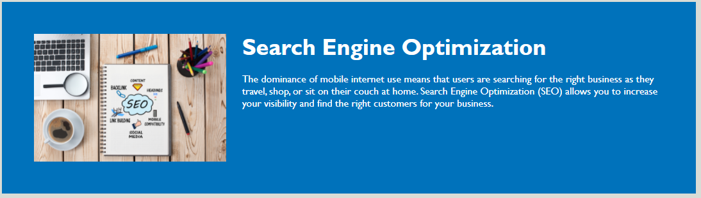
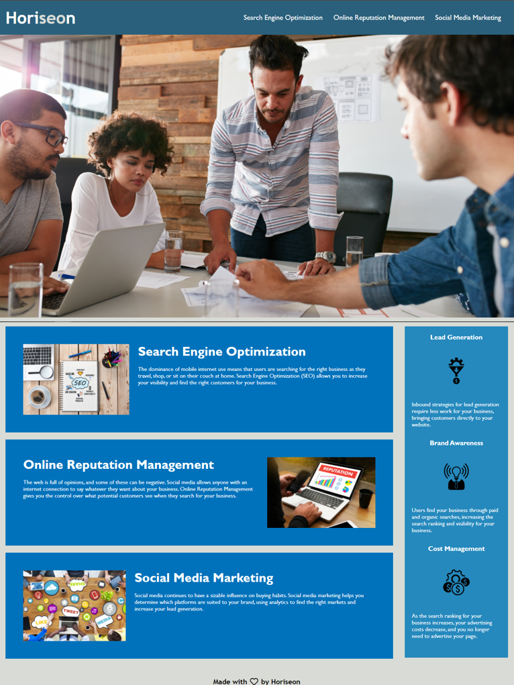

# Optimizing Webpage Accessibility for Users

---

## Motivation

Optimizing the webpage for search engine by increasing accessibility standard.
However, to achieve those goal refactoring is required. Start from making the HTML 
element become more semantic follow by logical structure independent of styling and 
positioning, accessbility of alt attributes.

Another reason of increasing accessibility is to get accessible sites rank by search 
engine like Google.

---
## Installation

The Installation of this webpage will be straight forward simply click the links below or 
copy the links to the browser you are going to use, to achieve the best experience of 
this website make sure you are using desktop.

Github link is provided to further check and test.

* Webpage Link
https://tirtasty.github.io/Horiseon-social-solution-services/

* Github Link
https://github.com/tirtasty/Horiseon-social-solution-services.git

---

## Usage

** On the homepage of the website there are 3(three) button or navigation link which will be 
leading you to the contain of it.

** If you click "Search Engine Optimization" Navigation Button will lead you to this page

** If you click "Online Reputation Management" Navigation Button will lead you to this page

** If you click "Social Media Marketing" Navigation Button will lead you to this 
page

** The whole page will be look like this if you keep scrolling around

---
## Contributors

- Tirta Styadi - <tirta.setiady@yahoo.com>

---

##

© Tirta Styadi, University Of Sydney Coding Bootcamp